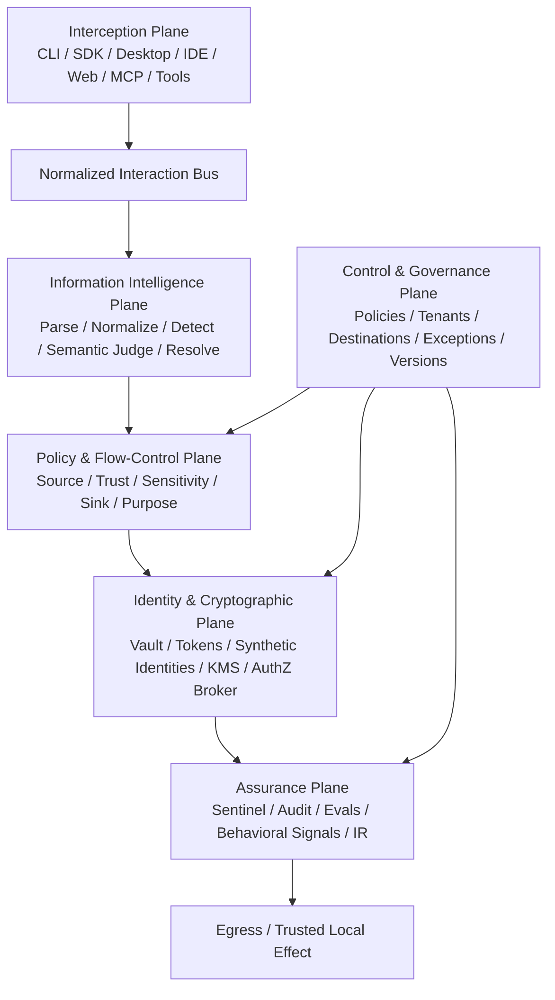
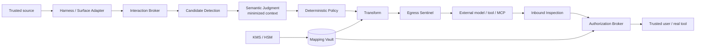

# Architecture

Status: accepted foundation direction. Implementation status lives in [plan.md](plan.md#current-state).

Hylja is a provider- and harness-independent information-control core surrounded by adapters. The core owns normalized interactions, classification composition, policy decisions, protected mappings, authorization, transformations, provenance, and audit evidence. Adapters translate surfaces; they do not own privacy policy.

## Six planes

The planes are logical boundaries. A first implementation may place several in one process, but contracts should preserve the ability to isolate the Mapping Vault, crypto broker, and audit pipeline later.

## Trust-zone flow

## Core ownership

The core owns:

- interaction IDs and provenance;
- content-type parsing and normalized fields;
- candidate and entity identities;
- semantic classification composition;
- source-to-sink policy;
- mapping lifecycle and scope;
- use/display/export authorization;
- transformation fidelity contracts;
- audit decisions and version identity;
- replayable evaluation evidence.

A harness or provider adapter owns only translation to/from a native protocol and declares capabilities honestly.

## Normalized interactions

Every boundary crossing is represented as one event rather than special-casing chat. See [interactions.md](interactions.md) and [contracts/interaction-envelope.md](contracts/interaction-envelope.md).

The initial event families are:

- `model.input`, `model.output`;
- `tool.call`, `tool.result`;
- `mcp.list`, `mcp.resource`, `mcp.prompt`, `mcp.call`, `mcp.result`;
- `file.list`, `file.read`, `file.search`, `file.write`, `file.diff`;
- `shell.command`, `shell.stdout`, `shell.stderr`;
- `skill.load`, `skill.resource`, `skill.execute`;
- `memory.read`, `memory.write`;
- `web.request`, `web.response`;
- `agent.handoff`, `agent.result`.

## Detection pipeline

Detection is layered:

1. Bounded normalization: Unicode normalization and safe decoding of known encodings.
2. Content parser: JSON, XML, YAML, dotenv, logs, URLs, connection strings, shell/script syntax, etc.
3. Deterministic detectors: secrets, credentials, network identifiers, known formats, configured dictionaries.
4. Candidate merger and entity resolver.
5. Local statistical/NER candidate generation when useful.
6. Semantic judgment for ambiguous candidates and contextual risk.
7. Deterministic policy composition.

A candidate missed before semantic judgment cannot be saved by a classifier. Candidate generation therefore favors recall; policy controls unnecessary cloaking.

## Semantic judgment boundary

Jev is one possible semantic judge. It may answer bounded questions such as:

- Does this candidate identify a natural person or customer environment?
- Is the exact value required to preserve task utility?
- Could the remaining sanitized context re-identify the protected entity?
- Is a candidate more likely an infrastructure identifier than an ordinary technical term?

Jev does not decide legal permissibility, grant access, choose decryption keys, or bypass deterministic policy. Where possible, the real candidate value is replaced by a local candidate token before semantic judgment so the external semantic service receives context rather than the secret itself.

## Source-to-sink enforcement

Every release decision considers source, sink, caller identity, purpose, semantic type, sensitivity, trust, representation state, destination profile, and required fidelity. The same value may be kept for a local model, synthetic for an approved enterprise model, and blocked for an arbitrary web request.

## Brokered uncloak

No general `GET /mapping/{id}` is part of the architecture. Resolution is an operation request containing subject, tenant/project, purpose, destination, entity, action, and session. The broker may:

- allow a trusted local operation to USE the real value without returning plaintext to the caller;
- allow DISPLAY to an authorized human surface;
- deny or require stronger approval;
- treat EXPORT as a separate high-risk permission.

## Independent egress control

The Egress Sentinel is intentionally independent of the primary semantic path. It checks known-original fingerprints, high-risk deterministic patterns, destination policy assertions, and canary values immediately before external release. Its failure mode for protected egress is restrictive.

## Contextual re-identification

String replacement alone is insufficient. A sanitized payload may uniquely reveal a customer, site, individual, or project from combinations of remaining facts. Re-identification risk is a distinct semantic signal and policy input. Generalization may be applied to rare locations, dates, project descriptions, or combinations even after direct identifiers are replaced.

## Data minimization

Raw prompts, log files, configuration files, and responses are processed in memory and are not persisted by default. Persist only the minimum reversible mappings, privacy-safe audit metadata, and explicitly approved evaluation artifacts.
